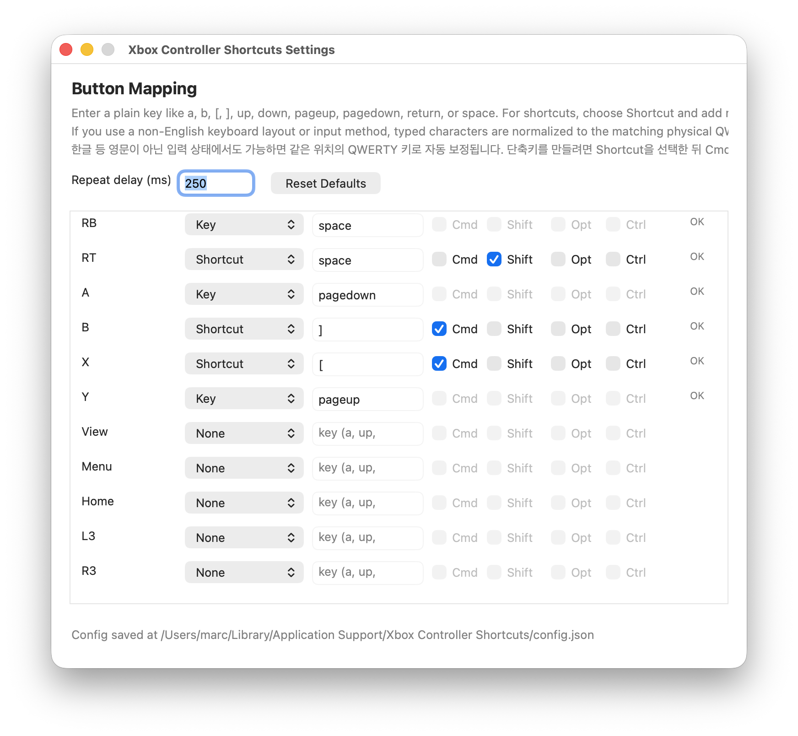

<<<<<<< HEAD
# Xbox-Controller-Shortcuts
A macOS menu bar app that maps Xbox controller buttons to keyboard shortcuts and scroll actions
=======
# Xbox Controller Shortcuts

Xbox Controller Shortcuts is a macOS menu bar app that maps Xbox controller buttons to keyboard shortcuts, plain keys, and scroll actions.

It is designed for document reading, browsing, slide control, and other lightweight productivity workflows on Mac.

## Highlights

- Menu bar app with a compact status item
- Live per-button remapping from a native settings window
- Shortcut support with `Cmd`, `Shift`, `Option`, and `Control`
- Scroll up/down actions for reading workflows
- Support for multilingual keyboard layouts with QWERTY key normalization when possible

## Screenshot



## Supported Buttons

- `dpad_up`, `dpad_down`, `dpad_left`, `dpad_right`
- `lb`, `lt`, `rb`, `rt`
- `a`, `b`, `x`, `y`
- `view`, `menu`, `home`
- `l3`, `r3`

## Supported Actions

- `None`
- `Key`
- `Shortcut`
- `Scroll Up`
- `Scroll Down`

Supported modifier names:

- `command`
- `shift`
- `option`
- `control`

Supported key names:

- letters `a-z`
- digits `0-9`
- punctuation like `[`, `]`, `-`, `=`, `;`, `'`, `,`, `.`, `/`, `` ` ``
- named keys: `return`, `tab`, `space`, `delete`, `escape`, `pageup`, `pagedown`, `left`, `right`, `up`, `down`
- scroll actions: `scroll_up`, `scroll_down`

## Build

```bash
git clone <your-repo-url>
cd xbox-controller-shortcuts
zsh build-app.sh
```

This builds:

- `Xbox Controller Shortcuts.app`

## Run

```bash
open "Xbox Controller Shortcuts.app"
```

Or double-click the app in Finder.

## Download

For end users, the easiest way to install the app is from GitHub Releases.

1. Download the latest `Xbox-Controller-Shortcuts-<version>-macOS.zip`
2. Unzip it
3. Move `Xbox Controller Shortcuts.app` wherever you want
4. Open the app

If macOS warns about the app on first launch, use `Open` from Finder or right-click the app and choose `Open`.

To create a release zip locally:

```bash
zsh package-release.sh v0.1.0
```

## Permissions

The app needs permission in:

- `System Settings > Privacy & Security > Accessibility`

If the menu shows `Accessibility Needed`, remove the app from the Accessibility list, add it again, then relaunch it.

## Config And Logs

The app stores runtime data here:

- Config: `~/Library/Application Support/Xbox Controller Shortcuts/config.json`
- Log: `~/Library/Application Support/Xbox Controller Shortcuts/app.log`

## Project Files

- `MenuBarApp.m`: main menu bar app source
- `build-app.sh`: builds the app bundle
- `app-template-start-Info.plist`: app bundle metadata
- `config.sample.json`: sample config reference

Legacy helper scripts from earlier prototypes are still included in the repo, but the current primary app is the menu bar app built by `build-app.sh`.

## Publishing

Suggested public release flow:

1. Push this repository to GitHub.
2. Run `zsh package-release.sh v0.1.0`
3. Create a GitHub Release with tag `v0.1.0`
4. Upload the generated zip as a Release asset
5. Paste the contents of `RELEASE_NOTES_v0.1.0.md` into the release notes if helpful

## License

MIT
>>>>>>> f2f4f6e (Initial public release)
